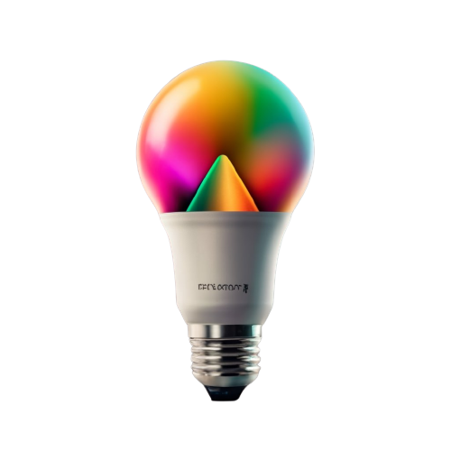

<a id="readme-top">

<!-- PROJECT SHIELDS -->
[![LinkedIn][linkedin-shield]][linkedin-url]

<!-- PROJECT HEADING -->
 

  

<h3 align="center">LuminaGlo!</h3>

  

    Welcome to the LuminaGlo project – a mock website for a fictional smart bulb brand.
     
    <a href="https://github.com/SammyG951/LuminaGlo-site"><strong>Explore the docs »</strong></a>
     
     
    <a href="https://github.com/github_username/repo_name">View Demo</a>
    ·
    <a href="https://github.com/SammyG951/LuminaGlo-site/issues">Report Bug</a>
  

<!-- TABLE OF CONTENTS -->

  
Table of Contents

  <ol>
    <li>
      <a href="#about-the-project">About The Project</a>
      <ul>
        <li><a href="#built-with">Built With</a></li>
        <li><a href="#useful-resources">Useful Resources</a></li>
      </ul>
    </li>
    <li><a href="#contact">Contact</a></li>
  </ol>

<!-- ABOUT THE PROJECT -->
## About the Project

[![Product Name Screen Shot][product-screenshot]]()

Exploring the art of web design and content integration with this creative project. Perfect for practicing web development skills and design inspiration.

(<a href=#readme-top>back to top</a>)

## Built with

* [![React][React.js]][React-url]

### Useful resources

- [ChatGPT](https://openai.com/blog/chatgpt) - For help with brainstorming the product and content creation for the website.
- [Ideogram](https://ideogram.ai/t/trending) - For creating the light bulb logo.
- [Material UI](https://mui.com/material-ui/) - For useful React components and Icons.
- [React Bootstrap](https://react-bootstrap.netlify.app/docs/components/carousel/) - For useful React components (Specifically testimonial carousel)
- [MESHER by CSS Hero](https://csshero.org/mesher/) - For title mesh gradient
- [unDraw](https://undraw.co/) - For testimonial photos

(<a href=#readme-top>back to top</a>)

<!-- CONTACT -->
## Contact

Samuel Gonzalez - sammy.gonzalez78@yahoo.com - [Github](https://github.com/SammyG951) - [LinkedIn][linkedin-url]

(<a href=#readme-top>back to top</a>)

<!-- MARKDOWN LINKS & IMAGES -->

[linkedin-shield]: https://img.shields.io/badge/-LinkedIn-black.svg?style=for-the-badge&logo=linkedin&colorB=555
[linkedin-url]: https://www.linkedin.com/in/samuel-gonzalez-iii/
[product-screenshot]: src/assets/images/Site-screenshot.png
[React.js]: https://img.shields.io/badge/React-20232A?style=for-the-badge&logo=react&logoColor=61DAFB
[React-url]: https://reactjs.org/